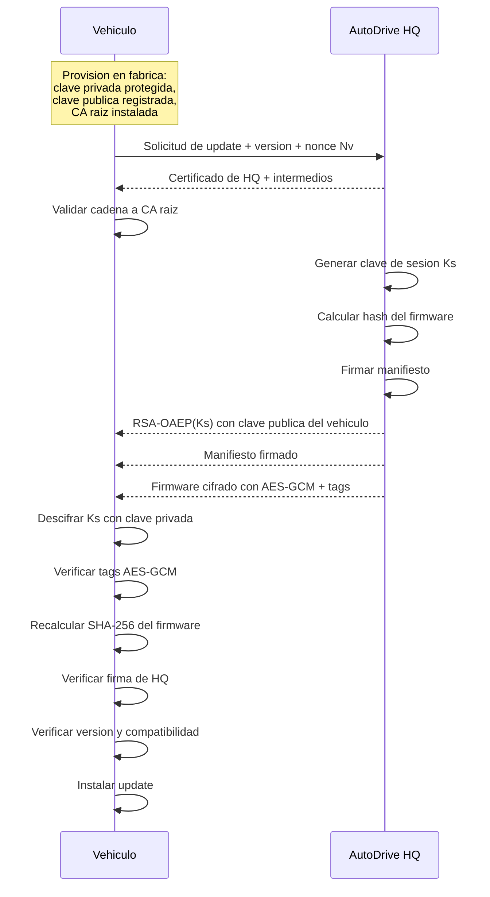

# Parte 5: Diseño del protocolo de actualización segura

**Estudiantes:** Juan Diego Chicaiza, María Emilia Granda, Sebastián Encalada
**Tema:** Sistema híbrido para proteger la actualización de firmware

## Objetivo del diseño

El protocolo debe ser **híbrido**:

- **Criptografía asimétrica** para identidad, autenticación y transporte seguro de la clave de sesión
- **Criptografía simétrica** para cifrar eficientemente el archivo grande de 2 GB

Esta separación no es opcional en un sistema serio. RSA no está diseñado para cifrar directamente un archivo de 2 GB; AES sí.

## Supuestos de seguridad

Antes de salir de fábrica:

1. el vehículo genera o recibe su propio par de claves RSA
2. la clave privada del vehículo se guarda en hardware protegido
3. HQ conoce la clave pública del vehículo
4. el vehículo almacena el certificado raíz que sirve de trust anchor para validar a HQ
5. HQ dispone de una clave privada específica para firmar releases de firmware
6. el vehículo usa secure boot para ejecutar solo firmware verificado

## Protocolo propuesto

### Flujo numerado

1. **Vehículo -> HQ: solicitud de actualización**  
   El auto envía su identificador, versión actual, plataforma y un nonce fresco `N_v`.

2. **HQ -> Vehículo: cadena de certificados**  
   HQ envía su certificado X.509 y, si hace falta, los certificados intermedios.

3. **Vehículo: validación de identidad de HQ**  
   El vehículo verifica:
   - cadena de certificados hasta la raíz instalada en fábrica
   - período de validez
   - uso correcto del certificado
   - identidad del servidor

4. **HQ: generación de clave de sesión**  
   HQ genera una clave aleatoria `K_s` para AES-256.

5. **HQ -> Vehículo: intercambio seguro de clave**  
   HQ cifra `K_s` con la clave pública del vehículo usando RSA-OAEP y la envía.

6. **HQ: construcción del manifiesto firmado**  
   HQ calcula:

\[
H_f = \text{SHA-256}(\text{firmware en texto claro})
\]

   y construye un manifiesto con:
   - versión del firmware
   - modelo objetivo
   - tamaño del archivo
   - hash `H_f`
   - fecha de emisión
   - expiración
   - contador anti-rollback
   - nonce o contexto asociado a la sesión

7. **HQ: firma del manifiesto**  
   HQ firma el manifiesto con su clave privada de firma, idealmente usando RSA-PSS.

8. **HQ -> Vehículo: envío del firmware cifrado**  
   HQ cifra el firmware en bloques mediante AES-256-GCM con `K_s` y transmite:
   - bloques cifrados
   - tags de autenticación

9. **Vehículo: recuperación de la clave de sesión**  
   El vehículo descifra `K_s` con su clave privada RSA.

10. **Vehículo: verificación de transporte**  
    El auto descifra cada bloque con AES-GCM y verifica su tag. Si un bloque falla, la actualización se rechaza inmediatamente.

11. **Vehículo: verificación final de integridad y autenticidad**  
    El vehículo reensambla el firmware en claro y calcula:

\[
H'_f = \text{SHA-256}(\text{firmware recibido})
\]

    Luego comprueba:
    - `H'_f = H_f`
    - la firma digital del manifiesto
    - que la versión sea válida
    - que el firmware corresponda a esa familia de vehículo

12. **Vehículo: instalación controlada**  
    Solo si todas las verificaciones son correctas, el firmware se instala.

13. **Reinicio con secure boot**  
    En el siguiente arranque, la cadena de arranque segura vuelve a verificar que el firmware instalado es uno autorizado.

## Diagrama Mermaid

## Cómo el diseño cumple cada requisito

| Requisito | Cómo lo cumple el diseño |
| --- | --- |
| **1. Secure Key Exchange** | HQ genera una clave de sesión AES y la cifra con la clave pública del vehículo usando RSA-OAEP. Solo ese auto puede recuperarla. |
| **2. Confidentiality** | El firmware de 2 GB se transmite cifrado con AES-256-GCM. Un competidor puede capturar tráfico, pero solo verá ciphertext. |
| **3. Integrity** | AES-GCM detecta alteraciones en tránsito por bloque y el hash SHA-256 del firmware completo detecta modificaciones del objeto final. |
| **4. Authentication** | El vehículo valida el certificado de HQ hasta la CA raíz instalada y verifica la firma digital del manifiesto con la clave pública certificada de HQ. |
| **5. Non-Repudiation** | HQ firma el manifiesto que contiene el hash exacto de la versión distribuida. Eso deja evidencia técnica de autorización de esa release específica. |

## Por qué este diseño es correcto

Cada pieza resuelve un problema distinto:

- el certificado responde: **¿realmente estoy hablando con HQ?**
- RSA responde: **¿solo este vehículo obtiene la clave de sesión?**
- AES-GCM responde: **¿el contenido viaja confidencialmente y sin alteraciones?**
- SHA-256 más firma responde: **¿HQ autorizó exactamente este firmware?**
- secure boot responde: **¿el vehículo ejecutará solo firmware verificado?**

Eso evita un error de diseño muy común: creer que una sola primitiva criptográfica basta para todo.

## Endurecimiento recomendado para producción

Si este sistema se implementara en una flota real, además agregaría:

1. separación entre clave de autenticación de servidor y clave de firma de firmware
2. protección de claves privadas en HSM y secure element
3. controles anti-rollback obligatorios
4. registros de auditoría firmados
5. revocación y rotación de certificados
6. expiración de manifiestos y control de ventanas de instalación

## Conclusión

El protocolo híbrido es la solución correcta porque combina la eficiencia de AES para datos masivos con la capacidad de RSA y de la PKI para autenticar identidades, transportar claves y respaldar no repudio. En un entorno como AutoDrive, donde un firmware malicioso puede comprometer seguridad física, este diseño no es un lujo: es un requisito mínimo de ingeniería responsable.

## Referencias

1. RFC 8017, *PKCS #1 v2.2: RSA Cryptography Specifications*.
2. RFC 5280, *Internet X.509 Public Key Infrastructure Certificate and CRL Profile*.
3. NIST FIPS 180-4, *Secure Hash Standard*.
