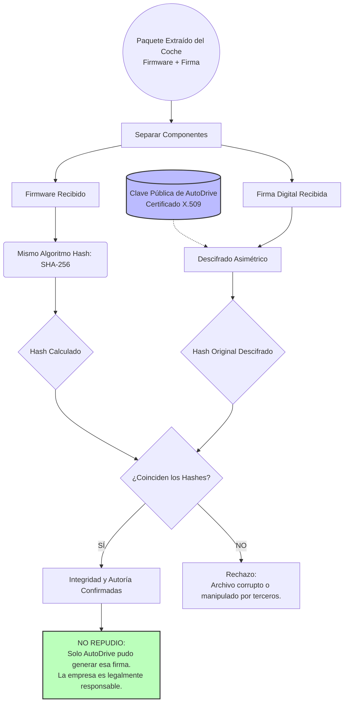

```mermaid    
    graph TD
        A((Paquete Extraído del Coche<br/>Firmware + Firma)) --> B[Separar Componentes]
        
        B --> C[Firmware Recibido]
        B --> D[Firma Digital Recibida]
        
        C --> E(Mismo Algoritmo Hash: SHA-256)
        E --> F{Hash Calculado}
        
        G[(Clave Pública de AutoDrive<br/>Certificado X.509)] -.-> H
        
        D --> H[Descifrado Asimétrico]
        H --> I{Hash Original Descifrado}
        
        F --> J{¿Coinciden los Hashes?}
        I --> J
        
        J -- SÍ --> K[Integridad y Autoría Confirmadas]
        K --> L[NO REPUDIO:<br/>Solo AutoDrive pudo generar esa firma.<br/>La empresa es legalmente responsable.]
        
        J -- NO --> M[Rechazo:<br/>Archivo corrupto o manipulado por terceros.]

        classDef public fill:#bbf,stroke:#333,stroke-width:2px;
        class G public;
        classDef legal fill:#bfb,stroke:#333,stroke-width:2px;
        class L legal;
```