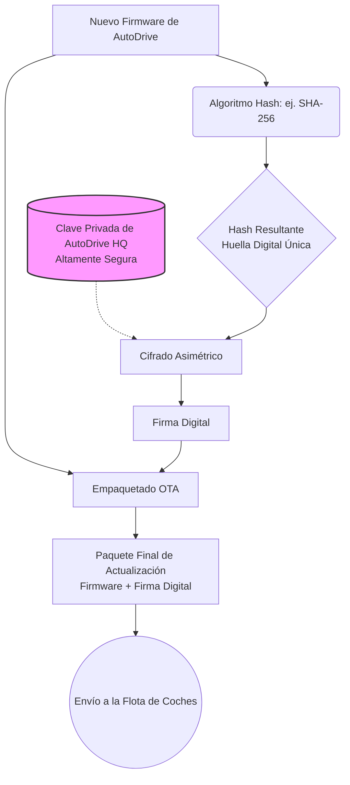

```mermaid
    graph TD
        A[Nuevo Firmware de AutoDrive] --> B(Algoritmo Hash: ej. SHA-256)
        B --> C{Hash Resultante<br/>Huella Digital Única}
        
        D[(Clave Privada de AutoDrive HQ<br/>Altamente Segura)] -.-> E
        
        C --> E[Cifrado Asimétrico]
        E --> F[Firma Digital]
        
        A --> G[Empaquetado OTA]
        F --> G
        
        G --> H[Paquete Final de Actualización<br/>Firmware + Firma Digital]
        H --> I((Envío a la Flota de Coches))

        classDef secure fill:#f9f,stroke:#333,stroke-width:2px;
        class D secure;
```