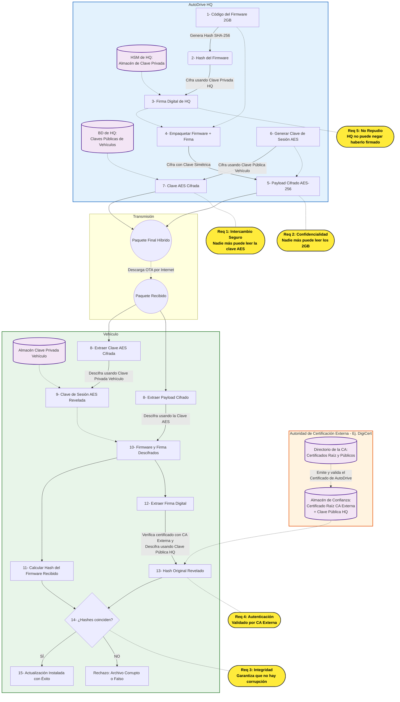

```mermaid
    graph TD
        %% Definición de estilos
        classDef req fill:#ffeb3b,stroke:#333,stroke-width:2px,color:#000,font-weight:bold;
        classDef hq fill:#e3f2fd,stroke:#1565c0,stroke-width:2px;
        classDef car fill:#e8f5e9,stroke:#2e7d32,stroke-width:2px;
        classDef ca fill:#fff3e0,stroke:#e65100,stroke-width:2px;
        classDef db fill:#f3e5f5,stroke:#4a148c,stroke-width:2px;

        subgraph CA_Externa [Autoridad de Certificación Externa - Ej. DigiCert]
            CA_DB[(Directorio de la CA:<br/>Certificados Raíz y Públicos)]:::db -.-> |"Emite y valida el<br/>Certificado de AutoDrive"| DB_Trust_Coche
        end
        class CA_Externa ca

        subgraph Sede_Central [AutoDrive HQ]
            DB_Priv_HQ[(HSM de HQ:<br/>Almacén de Clave Privada)]:::db -.-> C
            DB_Pub_Coches[(BD de HQ:<br/>Claves Públicas de Vehículos)]:::db -.-> G

            A[1- Código del Firmware 2GB] -->|Genera Hash SHA-256| B(2- Hash del Firmware)
            B -->|Cifra usando Clave Privada HQ| C[3- Firma Digital de HQ]
            A -.-> D[4- Empaquetar Firmware + Firma]
            C -.-> D
            D -->|Cifra con Clave Simétrica| E[5- Payload Cifrado AES-256]
            F[6- Generar Clave de Sesión AES] -->|Cifra usando Clave Pública Vehículo| G[7- Clave AES Cifrada]
            F -.-> E
        end
        class Sede_Central hq

        subgraph Transmisión
            E --> H((Paquete Final Híbrido))
            G --> H
            H -.->|Descarga OTA por Internet| I
        end

        subgraph Vehiculo [Vehículo]
            DB_Priv_Coche[(Almacén Clave Privada Vehículo)]:::db -.-> L
            DB_Trust_Coche[(Almacén de Confianza:<br/>Certificado Raíz CA Externa<br/>+ Clave Pública HQ)]:::db -.-> P

            I((Paquete Recibido)) --> J[8- Extraer Clave AES Cifrada]
            I --> K[8- Extraer Payload Cifrado]
            J -->|Descifra usando Clave Privada Vehículo| L[9- Clave de Sesión AES Revelada]
            L -.-> M
            K -->|Descifra usando la Clave AES| M[10- Firmware y Firma Descifrados]
            M --> N[11- Calcular Hash del Firmware Recibido]
            M --> O[12- Extraer Firma Digital]
            O -->|Verifica certificado con CA Externa y<br/>Descifra usando Clave Pública HQ| P[13- Hash Original Revelado]
            N --> Q{14- ¿Hashes coinciden?}
            P --> Q
            Q -- SÍ --> R[15- Actualización Instalada con Éxito]
            Q -- NO --> S[Rechazo: Archivo Corrupto o Falso]
        end
        class Vehiculo car

        %% Nodos flotantes para los 5 requisitos
        R1([Req 1: Intercambio Seguro<br/>Nadie más puede leer la clave AES]):::req
        R2([Req 2: Confidencialidad<br/>Nadie más puede leer los 2GB]):::req
        R3([Req 3: Integridad<br/>Garantiza que no hay corrupción]):::req
        R4([Req 4: Autenticación<br/>Validado por CA Externa]):::req
        R5([Req 5: No Repudio<br/>HQ no puede negar haberlo firmado]):::req

        %% Conexiones de los requisitos a los pasos clave
        G -.- R1
        E -.- R2
        Q -.- R3
        P -.- R4
        C -.- R5
```